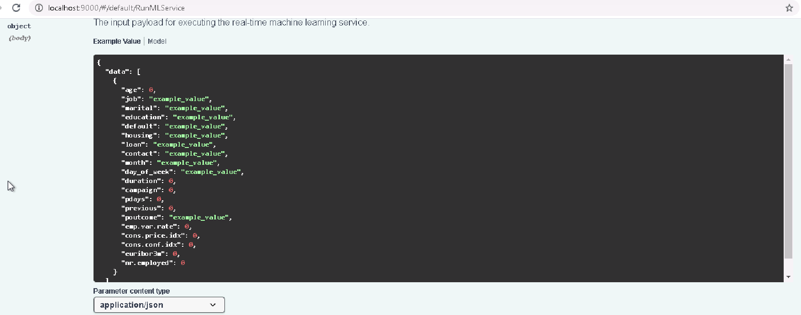

# Operationalizing Machine Learning

## Overview
This project is part of the Udacity Azure ML Nanodegree. In this project we use Microsoft Azure to configure a cloud based machine learning production model, deploy it, consume it.
  
## Summary 
The given dataset is bank marketing dataset.  We have to predict whether a client subscribed a term deposit or not. We first create a AutoML experiment with given dataset in ML Studio to find the optimal model. The optimal model is then deployed and is consumed via a REST-endpoint.
  

## Architectural Diagram
 

  
  
## Key Steps
### Step 1:
The dataset is registered in Azure ML Studio by uploading the file or by using the url. 
https://automlsamplenotebookdata.blob.core.windows.net/automl-sample-notebook-data/bankmarketing_train.csv 
 

  
  

### Step 2:
Next a AutoML run is crested to find the best model. 
The best model found is Voting Ensemble with 92% accuracy. 
 
 
    
The other model parameters are  

  
  

### Step 3:
The best run model is deployed by using ML Studio in Azure Container Instances. 
Authentication is enabled during the deployment. 
 

  
  

### Step 4:
Application Insights are enabled by running the logs.py script on the local machine in the terminal. 
The output of logs.py script are:  

  
  

### Step 5:
Swagger.json file is downloaded from the swagger uri. 
The swagger-ui is run on port 9000. The serve.py is run at port 8000. 
 

  
  

### Step 6:
For testing the REST endpoint the rest url and the appropriate keys are pasted in the endpoint.py file. 
The output after running the endpoint.py file is:  

  
  

### Step 7(optional):
The apache benchmark is run by using the benchmark.sh script. 
The report of benchmark is:  

